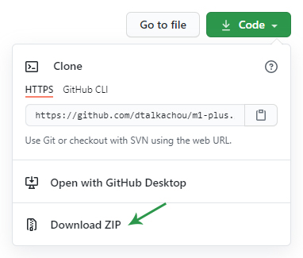

# M1 Plus

Расширение для сайта Monopoly One позволяющее смотреть дополнительные сведения без лишних действий.

## Установка

1. Скачайте ZIP-архив с исходным кодом данного расширения

2. Разархивируйте архив на своем компьютере

3. Перейдите в раздел расширения браузера Chrome (`Дополнительные инструменты` > `Расширения`)

4. В правом верхнем меню включите `Режим разработчика`

5. В появившейся строке нажмите на кнопку `Загрузить распакованное расширение` и в диалоговом окне укажите путь к папке m1-plus и нажмите `Выбор папки`

Готово! Расширение установлено и теперь играть в M1 станет еще приятней.

> **Важно!** Если у вас уже запущен сайт Monopoly One, обновите вкладку.
